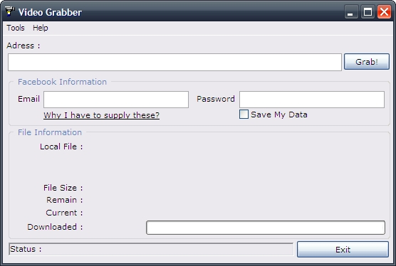



## Video Grabber

### Description

You can download Facebook videos and Youtube videos with this program.

You must have msxml.dll, msxml2.dll, comctl32.ocx and msinet.ocx in your system32 folder.

You can download these files from here :

http://www.mustafaberkanbicer.com.tr/code/msinet.rar

http://www.mustafaberkanbicer.com.tr/code/comctl32.rar

http://www.mustafaberkanbicer.com.tr/code/msxml.rar

http://www.mustafaberkanbicer.com.tr/code/msxml2.rar

Copy these files to your system32 folder. Then type first;

regsvr32 msxml.ocx

to Start&gt;Run... Then type;

regsvr32 msxml2.ocx

and register there ocx files.
 
### More Info
 
URL's must be in these formats:

http://www.youtube.com/v/Ok-uLymejT8

or

http://www.youtube.com/watch?v=Ok-uLymejT8

or

http://www.facebook.com/video/video.php?v=1041680850414&amp;oid=35950467799&amp;ref=nf

or

http://www.facebook.com/video/video.php?v=1012319822343&amp;ref=nf

             |
---                |---
**Submitted On**   |2009-01-01 23:21:10
**By**             |[Mustafa Berkan BICER](https://github.com/Planet-Source-Code/PSCIndex/blob/master/ByAuthor/mustafa-berkan-bicer.md)
**Level**          |Advanced
**User Rating**    |5.0 (15 globes from 3 users)
**Compatibility**  |VB 6\.0
**Category**       |[Internet/ HTML](https://github.com/Planet-Source-Code/PSCIndex/blob/master/ByCategory/internet-html__1-34.md)
**World**          |[Visual Basic](https://github.com/Planet-Source-Code/PSCIndex/blob/master/ByWorld/visual-basic.md)
**Archive File**   |[Video\_Grab213908122009\.zip](https://github.com/Planet-Source-Code/mustafa-berkan-bicer-video-grabber__1-71591/archive/master.zip)

